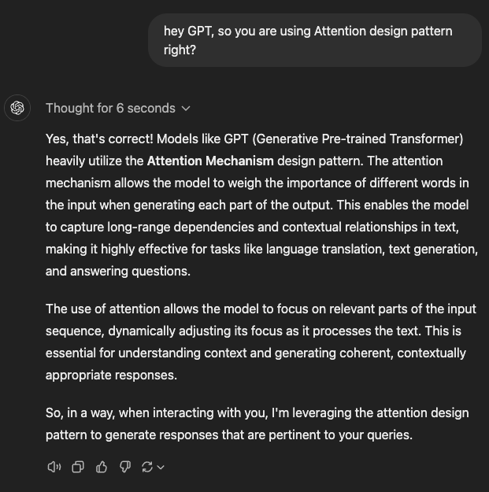
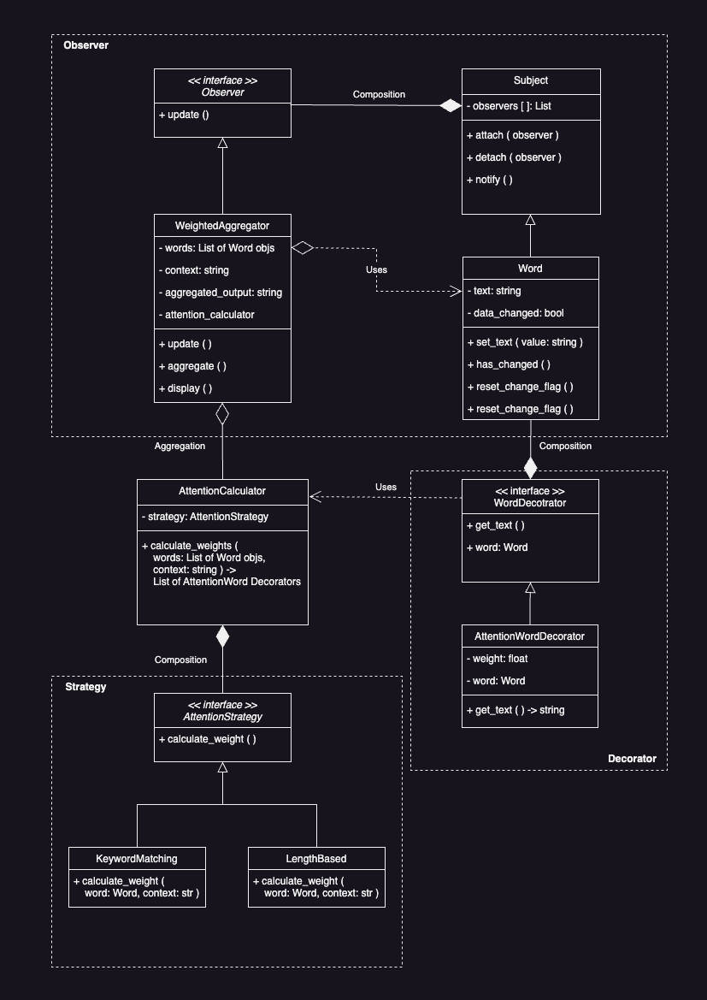

# Data Representation - Attention is All You Need

## The Attention Pattern Introduced

The attention pattern aligns closely with data representation models. It represents and processes data based on dyanmic efficiency. In a nutshell, the Attention pattern allows a system to dynamically focus on and priortize certain components / inputs over others, based on context-specific objectives, which improves effectiveness in decisoin-making.

https://youtu.be/eMlx5fFNoYc?si=37fwBZykRBDZImwZ&t=269 

## Rationale
In many deep learning systems, especially those with large amounts of data and many components, it is inefficient to treat all input parameters equally. Some inputs may rather be more relevant and important to the current context or task. \
The attention design pattern addresses this by providing a mechanism to evaluate and weight inputs dynamically, and so ensuring the most relevant information has the most significant influence on the output.

## Problems It Solves
1. When the relevance of input data is dependent of the context.
2. There is a time when we need to aggregate multiple inputs, but we want to prioritize some of them over others.
3. In a real-time system which requires adjustments of the current focus based on changing conditions.

## Industry Applications
1. NLP: ChatGPT o1-preview uses this design pattern as its learning architecture.
2. Recommendation System: This kind of system priortizes user preferences based on context or recent behaviours (like Chrome's Cookies, etc.).
3. Sensor Data Fusion: In robotics, there may be a bunch of sensors gathering data. Aggregating sensor inputs, and give more weight to the reliable sensors based on environmental conditions such as air dynamics, pressure differential, etc. 
  
  

## The UML

## The Toy Example

## The Sophisticated Example
### 1. Problem Statement

### 2. Solving the Problem Using the Attention Pattern

### 3. Codebase Design Explained

## References (Hyperlink-only)
- https://arxiv.org/abs/1706.03762
- https://www.envisioning.io/vocab/attention-pattern
- https://pmc.ncbi.nlm.nih.gov/articles/PMC7996841/
- https://www.researchgate.net/publication/383607494_Attention-Based_Method_for_Design_Pattern_Detection